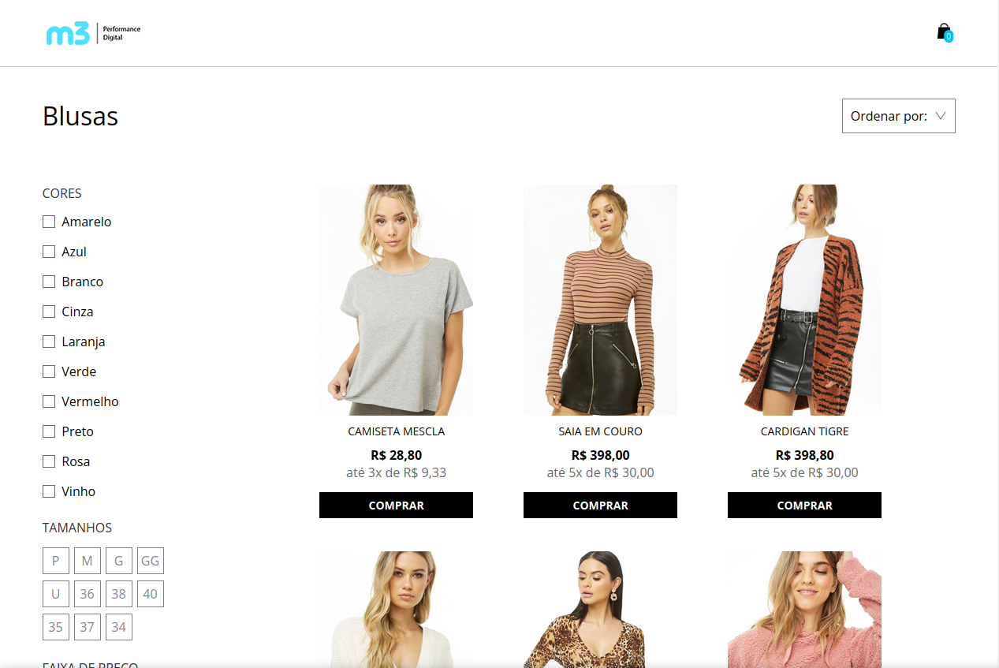

<div align="center" id="top"> 
  

&#xa0;

</div>

<h1 align="center">M3 Performance Digital</h1>

<p align="center">
  

  

  
</p>

<p align="center">
  <a href="#sparkles-features">Funcionalidades</a> &#xa0; | &#xa0;
  <a href="#rocket-technologies">Tecnologias</a> &#xa0; | &#xa0;
  <a href="#white_check_mark-requirements">Requerimentos</a> &#xa0; | &#xa0;
  <a href="#checkered_flag-starting">Iniciando</a> &#xa0; | &#xa0;
  <a href="https://github.com/tarcisiodelmondes" target="_blank">Author</a>
</p>

<br>


## :sparkles: Features

- Responsividade
- Carregar mais produtos

## :rocket: Tecnologias

As seguintes ferramentas foram utilizadas neste projeto:

- [Sass](https://sass-lang.com/)
- [Node.js](https://nodejs.org/en/)
- HTML5
- JavaScript
- Gulp
- Json-server

## :white_check_mark: Requisitos

Antes de iniciar :checkered_flag:, você precisa ter [Git](https://git-scm.com) e [Node](https://nodejs.org/en/) instalados.

## :checkered_flag: Iniciando

```bash
# Clone este projeto
$ git clone https://github.com/tarcisiodelmondes/Desenvolvedor-M3

# Acesse
$ cd Desenvolvedor-M3

# Instale as dependências
$ yarn
# Ou
$ npm install

# Inicie a aplicação
$ yarn start
# Ou
$ npm run start

# Irar subir um servidor na por 3000 para o site e outro na porta 5000 para o back-end
# Acesse o localhost para ver o site
$ http://localhost:3000
```

Feito com :heart: by Tarcísio Delmondes

&#xa0;

<a href="#top">Voltar pro topo</a>
